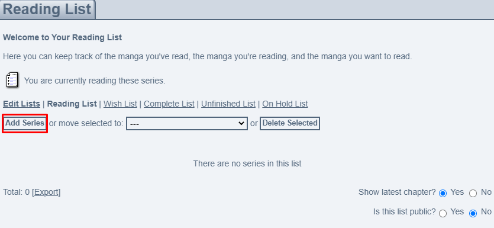
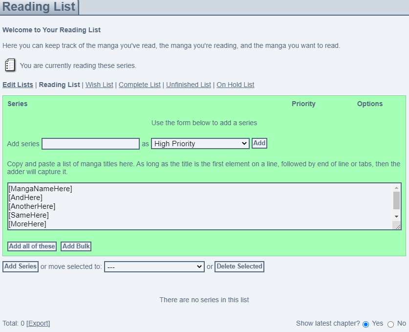

# MangaUpdateTranslate

This program is written in c and the propose is to translate the .xml file exported from MyAnimeList to a .txt having the names from all saved mangas, the program only adds the names.

The simple version create one big file with all names, no helpfull
The complex creates a file for each status,
-read, Reading
-comp, Completed
-hold, On-Hold
-drop, dropped
-wait, plan to read

# How to Use

  - Create a folder
  - Download translator.c(simple or complex)
  - Go to your MAL List and export the list
  - Rename it: mangalist.xml
  - Put all files in the folder
  - Compile and Run
    - It going to generate a .txt file named: namelist.txt
    - In the complex version it going to generate list_(comp, drop, hold, read, wait).txt
  - Open and look if everything is fine, if it is, copy
  - Go to your MangaUpdates List
  - Click "Add Series" and "Add Bulk"
    -For complex change witch list you are
  - Paste the text on the big box
  - Click "Add all of these"
  - And that it
  - *Some names are not on the DB so an error message is going to appear, copy the names and look/add manually for those* 
 
# Imagens
  <!--

           
  

    |  
:------------------------------------------------------------:|:-------------------------------------------------------------:
   |  
 
-->
 
 
 
 

# OS

  - Windows/Linux: works with GCC
  - Mac: Need test
